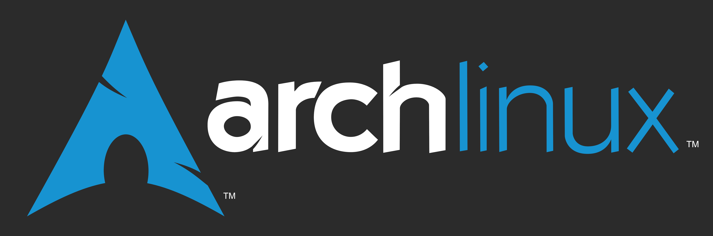

# Rice GNU/Linux
The aim of this repo is to record a process for the complete beginner to get started with GNU/Linux. This is refined record of my own process of migrating from MacOS to GNU/Linux, it is a live document that is updated as I discover things along the way.
The process is documented in [the wiki for this repo](https://github.com/mahmon/rice-gnu-linux/wiki "Rice GNU/Linux wiki")
As well as the documentation, this is also a repository of the various configuration files and resources used in this process, especially those I use as part of ricing arch.
Here's our logo (hover to see the title text):

